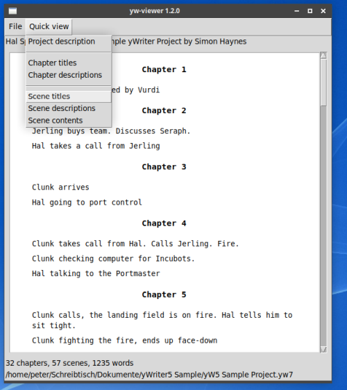
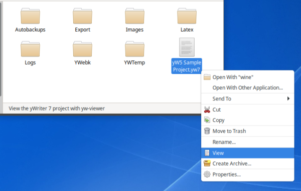

[yWriter](http://spacejock.com/yWriter7.html) is a free word processor written by Australian author and programmer Simon Haynes. 

The *yw-viewer* script is mainly intended for Linux users who manage multiple yWriter projects, because yWriter takes a long time to start under Wine. However, it is designed to run on several operating systems. On windows, an optional context menu entry for *.yw7* project viewing is provided. 

## Features

- View project properties: Author and description.
- View chapter titles.
- View chapter descriptions.
- View scene titles.
- View scene descriptions.
- View scene contents.
- Only "normal" chapters and scenes are shown. "Notes", "To Do", and unused chapters/scenes are left out.
- All output is Markdown formatted and can be selected and copied. 

## Requirements

- [Python 3](https://www.python.org). Python 3.4 or more recent will work.
- Tk support for Python. This is usually part of the Windows Python installation, but may need to be installed additionally under Linux.

## Download and install

[Download the latest release (version 0.5.2)](https://raw.githubusercontent.com/peter88213/yw-viewer/main/dist/yw-viewer_v0.5.2.zip)

- Unzip the downloaded zipfile "yw-viewer_v0.5.2.zip" into a new folder.
- Move into this new folder and launch **setup.pyw**. This installs the script for the local user.
- Create a shortcut on the desktop when asked.
- Open "README.md" for usage instructions.

### Note for Linux users

Please make sure that your Python3 installation has the *tkinter* module. On Ubuntu, for example, it is not available out of the box and must be installed via a separate package. 

------------------------------------------------------------------

[Changelog](changelog)

## Usage

See the [instructions for use](usage)

## License

yw-viewer is distributed under the [MIT License](http://www.opensource.org/licenses/mit-license.php).
